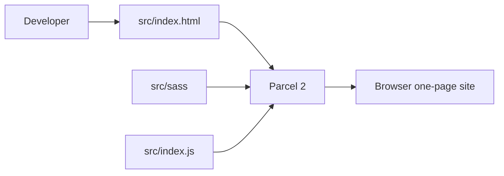
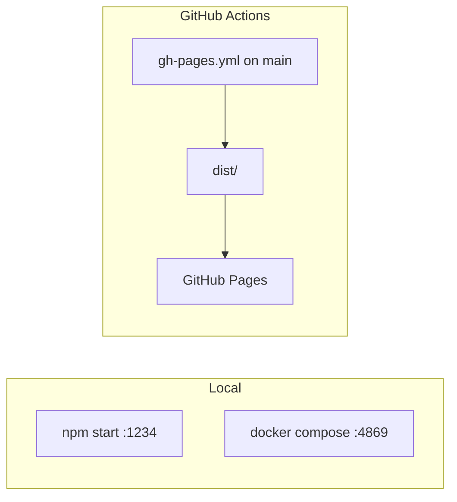

# simplefolio — Architecture

## ViePilot organization context
Profile: none (not configured). Org recorded in PROJECT-META.md as Phú Nguyễn.

## System overview
Static one-page portfolio. No server, no database, no API.

Source: `.viepilot/architecture/system-overview.mermaid`

## UI assumptions (direction skipped)
User skipped UI workspace (2026-09-25). Assumptions, not a design spec:
- One page: `src/index.html` (hero, about, projects, contact, footer).
- Bootstrap 5 + custom SCSS under `src/sass/`. Do not replace the design system in ops/docs work.
- Motion: ScrollReveal (eager) + vanilla-tilt (lazy, failure must not hide content).

## Data flow
N/A — no persisted data. Content is HTML + files in `src/assets/`.

## Event flows
N/A — no message bus. Browser-only scroll/tilt listeners.

## Module dependencies
Optional (single package, no workspace graph):

| Module | Depends on |
|--------|------------|
| `src/index.html` | Bootstrap markup, assets |
| `src/styles.scss` | `src/sass/**`, Bootstrap Sass |
| `src/index.js` | `scripts/scrollReveal`, `scripts/tiltAnimation` |

## Deployment

Source: `.viepilot/architecture/deployment.mermaid`

- Local npm: Parcel default port 1234.
- Docker: `node:22-alpine`, `npm ci`, Parcel `--host 0.0.0.0 --port 4869`. Compose bind-mounts repo, anonymous volume on `/app/node_modules`, `CHOKIDAR_USEPOLLING=true`.
- CI: `.github/workflows/gh-pages.yml` builds on branch `main` and publishes `dist/`. Local default branch is `master` — workflows will not run until that mismatch is resolved.

## User use case
N/A as a system diagram — single visitor flow: open page, read sections, download resume, follow social links.

## Technology decisions

| Decision | Rationale |
|----------|-----------|
| Keep Parcel + Bootstrap | Already shipping; brownfield, no rewrite |
| Docker for local run only | Compose is a dev server, not a production image |
| MIT for ViePilot artifacts | Matches LICENSE.md; ignore ISC in package.json |
| No backend | Static portfolio |

## Diagram matrix

| Type | Status |
|------|--------|
| system-overview | required |
| data-flow | N/A |
| event-flows | N/A |
| module-dependencies | optional |
| deployment | required |
| user-use-case | N/A |
